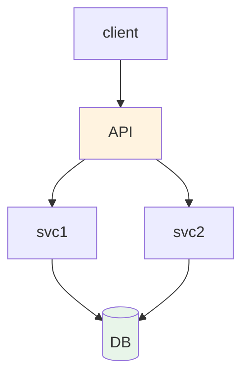

```mermaid
graph TB
    api[API]
    db[(DB)]
    client --> api
    api --> svc1
    api --> svc2
    svc1 --> db
    svc2 --> db

classDef frontend fill:#e1f5fe
classDef service fill:#fff3e0
classDef database fill:#e8f5e9
classDef queue fill:#fce4ec


class api service
class db database

```